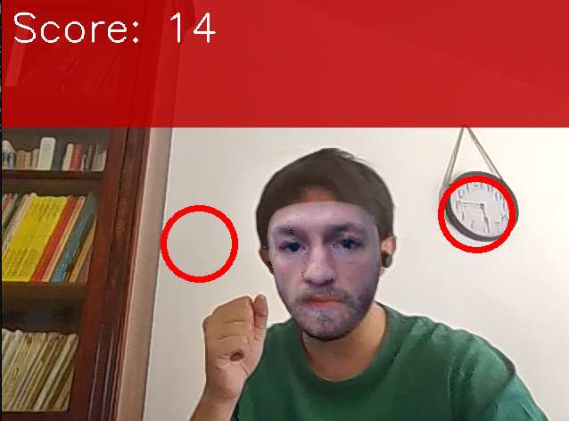

# 🥊Boxing Simulator🥊

An interactive mini-game in Python/OpenCV where you have to hit targets on the screen with your hands, detected in real time by your webcam using MediaPipe Pose (PoseNet model).  
Obstacles appear to make the game more challenging, and a custom face swap made with MediaPipe too is made on your face.

## Features

- **Hand and head detection** with MediaPipe Pose
- **Targets to hit** with your hand (real-time scoring)
- **Dynamic obstacles** to avoid with your head
- **Face Swap** on the player (image/head.png)

## Screenshots

Stand up in front of your screen and hit the red circles:



Watch out! You also have to dodge the red zones:


## FaceSwap

The face swap feature uses MediaPipe Face Detection to identify faces in real-time and replaces them with a custom image (`image/head.png`). 

**How it works:**
1. **Face Detection**: MediaPipe detects face landmarks and bounding box
2. **Image Processing**: The custom head image is resized and rotated to match the detected face orientation

The `FaceSwapper` class handles all the heavy lifting - just drop your custom head image in `image/head.png` and you're ready to go!

You can test the faceswap by lauching the `faceswap.py` script.

## Installation

1. **Clone the repository**  
   ```bash
   git clone https://github.com/patateeeeee/boxing_simulator.git
   cd boxing_simulator
   ```

2. **Install dependencies**  
   ```bash
   pip install -r requirements.txt
   ```

3. **(Optional) Add a custom head image** in `image/head.png` to personalize your head 

## Usage

```bash
python main.py
```

- Press `q` to quit the game.

## Project Structure

```
boxing_simulator/
├── image/
│   └── head.png            # Head image displayed on the player
├── main.py                 # Main script
├── faceswap.py             # FaceSwap script
├── boxing.py               # Boxing Game script
├── requirements.txt        # Python dependencies
├── README.md               # This file
└── .gitignore
```

## Dependencies

- opencv-python
- mediapipe
- numpy

---

Project made for fun and to experiment with MediaPipe features.